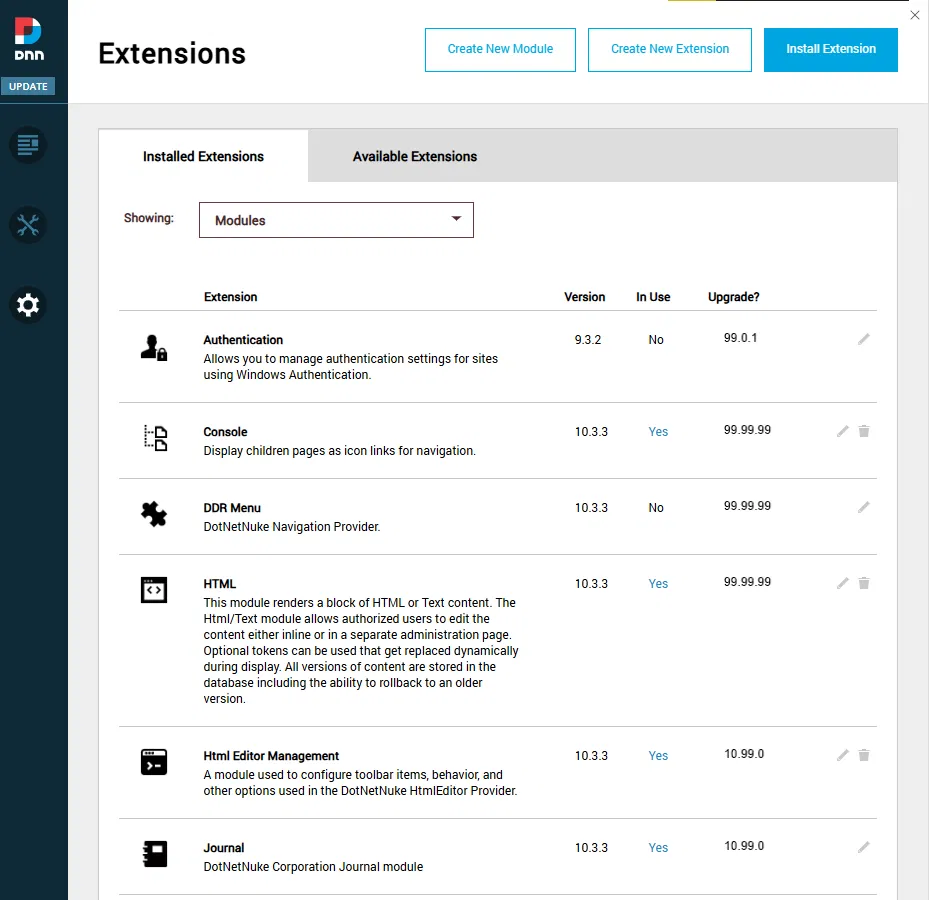
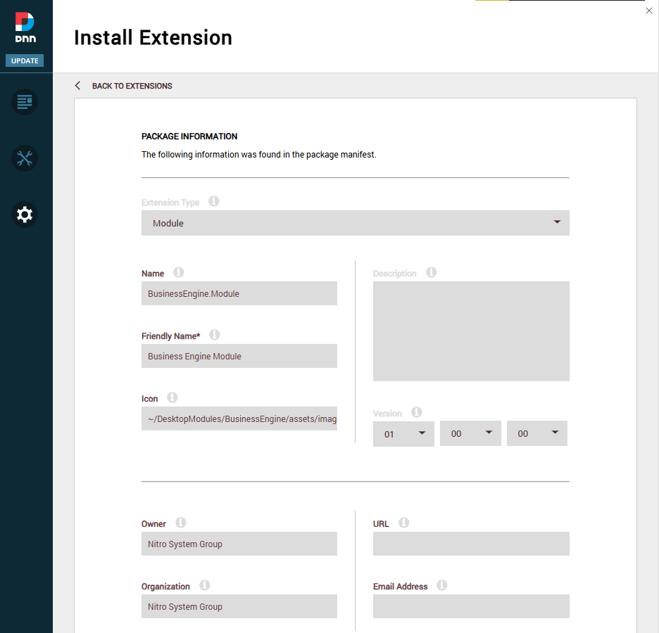
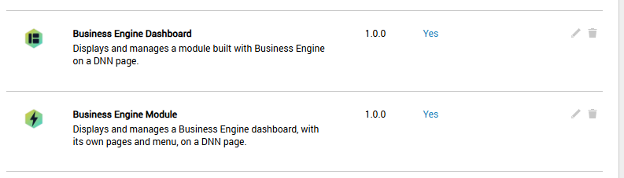
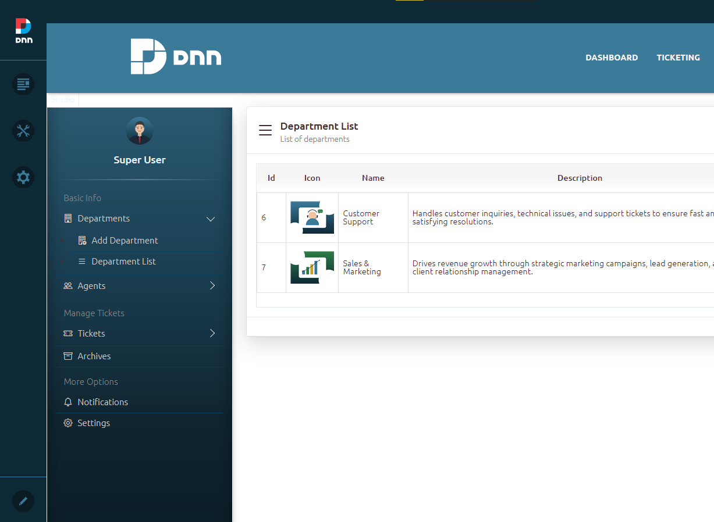
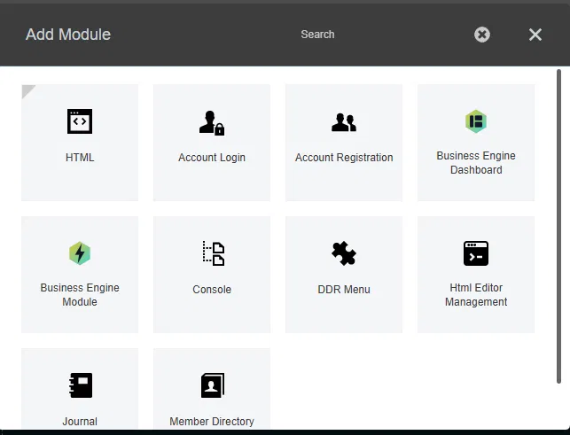

# Installation

This page explains what you need to run Business Engine and how to install it on your DNN website.

---

## Requirements

| Component | Requirement |
|---|---|
| DNN (DotNetNuke) | Version **9.4.0 or later** (fully compatible with **DNN 10**) |
| .NET Framework | **4.8** |

---

## Installing the package

Business Engine is installed like any other DNN extension.

1. Download the installation package from the [Business Engine repository](https://github.com/nitrosystem/Dnn.BusinessEngine).
2. Log in to your DNN website as a **host/super user**.
3. Go to **Settings → Extensions**.
4. Click **Install Extension** and upload the package you downloaded.

   

5. Follow the installation wizard. On the **Package Information** step you will see the details found in the package manifest. Click **Next** to continue and complete the installation.

   

> **Tip:** For general details about installing extensions, see the official DNN documentation.

---

## What gets installed

After a successful installation, two modules are added to the list of installed modules in DNN:

### Business Engine Module

Manages and displays a module built with Business Engine on a DNN page.

### Business Engine Dashboard

Manages and displays a dashboard module built with Business Engine on a DNN page.

A dashboard has its own pages, which you manage inside the **Business Engine Studio**. These pages are shown as a **vertical or horizontal menu** inside the dashboard module. They are **not** separate DNN pages.

---

## Adding a module to a page

1. Open the DNN page where you want to use Business Engine.
2. Open the **Add Module** panel from the DNN control bar.
3. Select **Business Engine Module** (or **Business Engine Dashboard**) and add it to the page.

   

Once the **Business Engine Module** is on the page, you will enter the **Studio**, where you can select or create your first scenario. Continue with [Selecting or Creating a Scenario](02-scenarios.md).
